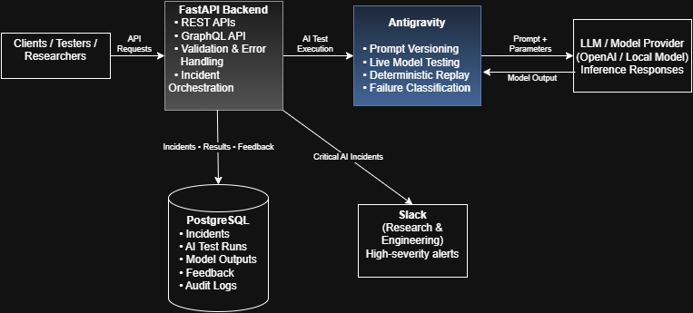

# System Architecture

## Overview
This project is an AI Incident Intelligence Platform designed to observe, test, and document AI model behavior during live development and experimentation.

The architecture prioritizes:
- clear separation of concerns
- reproducible AI testing
- structured incident documentation
- fast collaboration between research and engineering teams

---

## High-Level System Flow
1. Clients, testers, or researchers interact with the system using REST or GraphQL APIs.
2. The FastAPI backend validates requests and orchestrates AI-related operations.
3. All AI testing is routed through Antigravity, which manages prompt versions and test scenarios.
4. Antigravity executes live model tests and returns structured outputs and failure signals.
5. The backend persists results as incidents, test runs, and feedback.
6. High-severity AI failures trigger Slack alerts for immediate visibility.

---

## Role of Antigravity
Antigravity is treated as a first-class AI testing layer rather than a utility library.

Separating Antigravity from the backend enables:
- prompt versioning independent of application code
- deterministic replay of AI failures
- safe live coding and experimentation
- consistent classification of model errors

This design allows AI behavior to be observed and reasoned about systematically instead of anecdotally.

---

## API Design Strategy
The system intentionally uses both REST and GraphQL APIs:

- **REST APIs** handle write-heavy and operational workflows such as creating incidents, triggering AI test runs, and submitting feedback.
- **GraphQL** supports read-heavy, exploratory access to incident data, allowing researchers to query nested relationships efficiently.

This hybrid approach balances strict validation with flexible data exploration.

---

## Data & Persistence
The database schema is designed around AI behavior rather than traditional CRUD patterns.

Core entities include:
- Incidents
- AI Test Runs
- Model Outputs
- Feedback
- Audit Logs

Schema evolution is driven by observed model behavior and testing results, not assumptions.

---

## Collaboration & Feedback Loop
Slack integration ensures critical AI regressions and failures are visible to research and engineering teams in real time.

This closes the loop between experimentation, observation, and system improvement.
